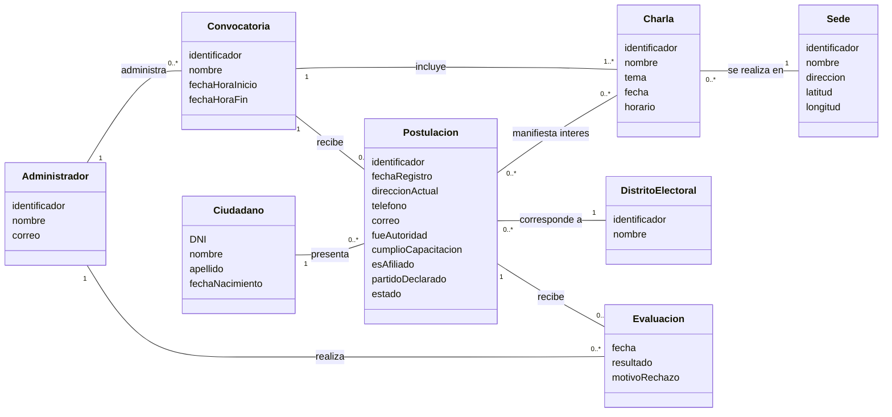

# Propuesta de modelo conceptual

Borrador de apoyo para revisar e incorporar al PDF del TP. Representa el dominio del enunciado completo; la web implementa solamente inscripción, charlas y ubicación. Los servicios de correo y mapas son actores externos, no entidades del dominio.

## Lectura de entidades y relaciones

- **Convocatoria:** delimita el período de inscripción y reúne sus charlas y postulaciones. Se supone un administrador responsable por convocatoria.
- **Charla:** actividad de orientación con nombre, tema, fecha y horario; pertenece a una convocatoria y ocurre en una sede. Una sede puede albergar varias charlas.
- **Sede:** nombre y dirección del lugar. Las coordenadas permiten ubicarla mediante el servicio externo.
- **Ciudadano:** identidad de la persona. Puede postularse a distintas convocatorias; se adopta una postulación por DNI en cada convocatoria.
- **Postulación:** solicitud del ciudadano para una convocatoria y un distrito. Los datos de contacto y antecedentes reflejan lo declarado al momento de inscribirse. Su estado puede ser pendiente, aprobada o rechazada.
- **Distrito electoral:** referencia seleccionada obligatoriamente al postularse. No se infiere a partir de la sede de una charla.
- **Interés en charla:** relación opcional de muchos a muchos. Solo pueden elegirse charlas de la misma convocatoria. No representa reserva, inscripción a la charla ni asistencia.
- **Evaluación:** resultado administrativo posterior al cierre. Una postulación puede no estar evaluada o tener una evaluación. El motivo es obligatorio si se rechaza.
- **Administrador:** responsable de las convocatorias y de la evaluación. Las operaciones administrativas no están implementadas en esta web.

## Restricciones

1. La fecha de inicio coincide con la primera charla y la fecha de fin con la última. Para el prototipo se incluyen ambos días completos en UTC−03:00.
2. No se admiten postulaciones fuera de plazo.
3. El partido declarado es obligatorio cuando existe afiliación; de otro modo queda vacío.
4. No se exige experiencia, capacitación ni interés en charlas para registrar una postulación.
5. La evaluación se realiza después del cierre; aprobar o rechazar produce una notificación en el sistema completo.
6. El reporte final deriva de las postulaciones aprobadas; los reportes se consideran resultados de consulta y no entidades persistentes en este modelo mínimo.

## Correspondencia con el código

En la implementación, `datos.js` representa la convocatoria, distritos, sedes y charlas. Cada registro de solicitud contiene los datos del ciudadano junto con los propios de la postulación; esa simplificación de almacenamiento no altera la distinción conceptual entre persona y solicitud. Los intereses se guardan como identificadores de charlas. Evaluación y administrador quedan únicamente en el modelo del sistema completo.

Revisar con el grupo las decisiones de cardinalidad, la regla de unicidad por DNI y el tratamiento de reportes antes de dar por definitivo el diagrama de dominio.
